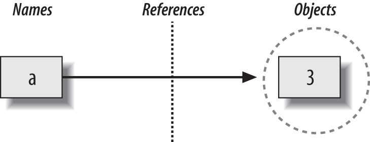
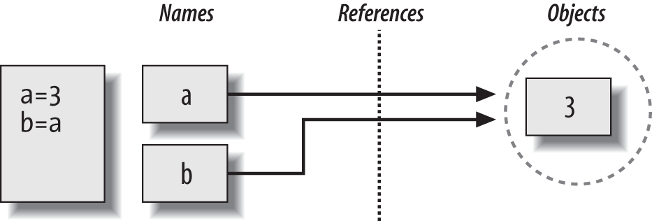
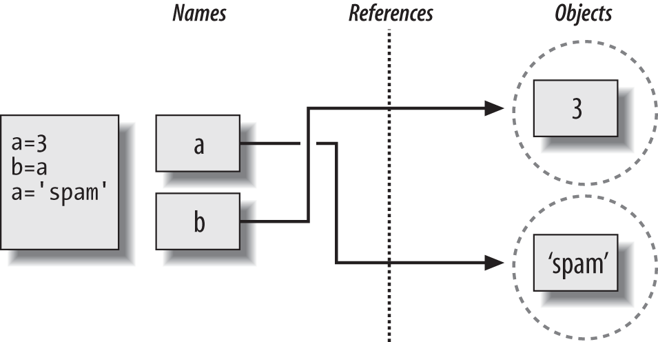
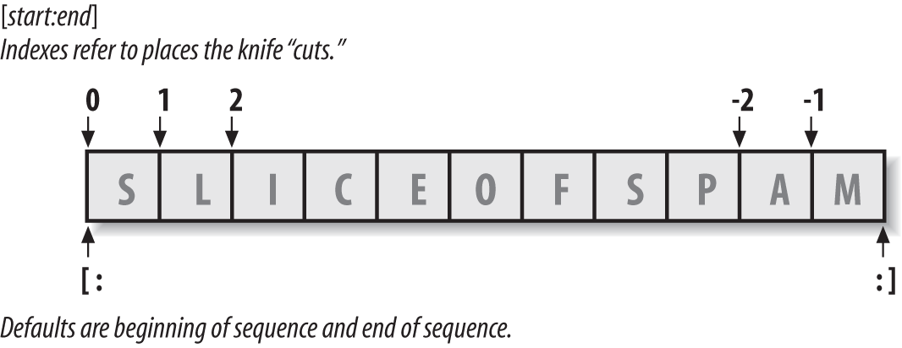
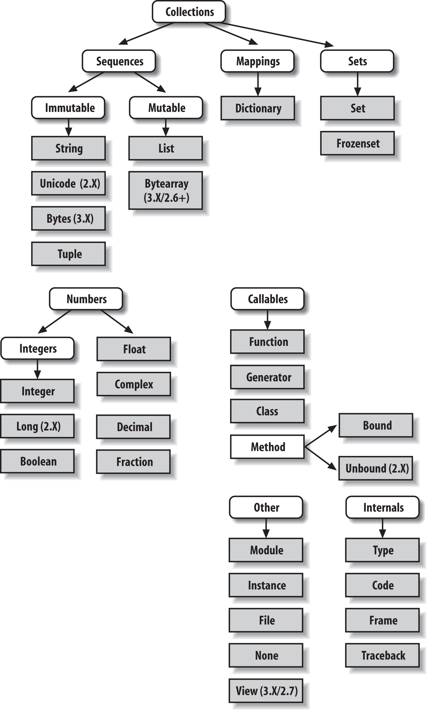

# Table of Contents

1.  [Build-in object preview](#org41f7209)
2.  [Immutability](#org54daeed)
3.  [bytearray](#org2427bf9)
4.  [泛型操作和类型操作](#org7368d17)
5.  [Pattern Matching](#orgb4bbc3e)
6.  [List comprehension expression](#orga0a7119)
7.  [Dictionaries](#orgc62b75b)
8.  [Iteration](#org38fae86)
9.  [Tuples](#org2642e45)
    1.  [Why Tuples?](#org188fac7)
10. [Files](#orga7ebb23)
11. [Numeric Types](#orgea0a144)
    1.  [Numeric Literals](#org23d9e63)
        1.  [Decimal Type](#org3b89669)
        2.  [Fraction Type](#org201f527)
    2.  [IMMUTABLE CONSTRAINTS AND FROZEN SETS](#org956179f)
        1.  [WHY SETS?](#org9808490)
    3.  [Booleans](#org2431c84)
12. [Dynamic Type(动态类型)](#org7f0d1c5)
    1.  [Shared References](#org08d3897)
    2.  [Shared References and In-Place Changes](#org901a3cb)
    3.  [Shared References and Equality](#org8a6dc00)
    4.  [Dynamic Typing Is Everywhere](#org7d0906d)
    5.  [“WEAK” REFERENCES](#orga62f4f3)
13. [String Fundamentals](#orgd139ac8)
    1.  [Unicode: The Short Story](#org36402b9)
    2.  [String Basics](#org5fd3fe9)
    3.  [String Literals](#org1541dc3)
        1.  [Single- and Double-Quoted Strings Are the Same](#org7437c07)
        2.  [Escape Sequences Represent Special Characters](#org72f67f8)
        3.  [Raw Strings Suppress Escapes](#org20ce518)
        4.  [Triple Quotes Code Multiline Block Strings](#orga0b9f05)
    4.  [Strings in Action](#orga95428b)
        1.  [Basic Operations](#org30f9801)
        2.  [Indexing and Slicing](#org1ce1ef6)
        3.  [String Conversion Tools](#orgd904421)
    5.  [String Methods](#org2b07b4c)
        1.  [Methods of Strings](#orgf95808b)
        2.  [String Method Examples: Changing Strings II](#org8b85884)
    6.  [String Formatting Expressions](#orgd540a31)
        1.  [Adding Keys, Attributes, and Offsets](#org3774467)
    7.  [General Type Categories](#orgeef5694)
        1.  [Mutable Types Can Be Changed in Place](#org5764783)
14. [Lists and Dictionaries](#org8af55ed)
15. [Tuples, Files, and Everything Else](#org821162b)
    1.  [Tuples](#orge0ef143)
        1.  [Tuples in Action](#orgeef8640)
        2.  [Why Lists and Tuples?](#org1acc06f)
        3.  [Records Revisited: Named Tuples](#orgdde0150)
    2.  [Files](#org0a758a3)
        1.  [Opening Files](#org9cb9364)
        2.  [Files in Action](#org6d7f789)
        3.  [Storing Native Python Objects: pickle](#org6278b58)
        4.  [Storing Python Objects in JSON Format](#org4bdde13)
        5.  [CVS](#orgc234ec0)
        6.  [Storing Packed Binary Data: struct](#org0b07aa4)
        7.  [File Context Managers](#org24f3cb6)
    3.  [Core Types Review and Summary](#orgc8d9ec7)
        1.  [Object Flexibility](#orge95292d)
        2.  [Assignment Creates References, Not Copies](#org9eff367)
        3.  [Repetition Adds One Level Deep](#orgaa69280)
        4.  [Beware of Cyclic Data Structures](#orgfdc099d)
        5.  [Immutable Types Can’t Be Changed in Place](#orge70c7ea)
16. [Chapter 10. Introducing Python Statements](#org6673357)
    1.  [The Python Conceptual Hierarchy Revisited](#orgfcef593)
    2.  [Python’s Statements](#orgd7f6066)
17. [Chapter 11. Assignments, Expressions, and Prints](#org8ceb7ce)
    1.  [Assignment Statements](#orge5aaa0f)
        1.  [Extended Sequence Unpacking in Python 3.X](#orgd40b16a)
        2.  [Augmented Assignments](#org92794c7)
        3.  [Variable Name Rules](#orgbdbf451)
    2.  [Expression Statements](#orge3984ec)
        1.  [Expression Statements and In-Place Changes](#org753d5bc)
    3.  [Print Operations](#org1089b14)
        1.  [The Python 3.X print Function](#org710a0f2)
18. [Chapter 12. if Tests and Syntax Rules](#org9319a3a)
    1.  [if Statements](#orgd7df859)
        1.  [HANDLING LARGER ACTIONS](#orge240db1)
    2.  [Python Syntax Revisited](#org3d474f3)
19. [Chapter 13. while and for Loops](#orga6c5be9)
    1.  [while Loops](#orga9b4388)
        1.  [General Format](#org51b468a)
    2.  [break, continue, pass, and the Loop else](#org4553d1e)
        1.  [General Loop Format](#org94ccc2d)
        2.  [Loop else](#org4c94df6)
    3.  [for Loops](#orgc99aa2d)
        1.  [General Format](#orgce5144a)
    4.  [Loop Coding Techniques](#org7987248)
        1.  [Counter Loops: range](#org92b2774)
        2.  [Sequence Scans: while and range Versus for](#org04c92fb)
        3.  [Nonexhaustive Traversals: range Versus Slices](#org9a21639)
        4.  [Changing Lists: range Versus Comprehensions](#orgd60b0fb)
    5.  [Parallel Traversals: zip and map](#orgedc3552)
        1.  [DICTIONARY CONSTRUCTION WITH ZIP](#orgd4fbf08)
    6.  [Generating Both Offsets and Items: enumerate](#org31254c5)
20. [Chapter 14. Iterations and Comprehensions](#orgded8981)

# Build-in object preview

<table border="2" cellspacing="0" cellpadding="6" rules="groups" frame="hsides">

<colgroup>
<col  class="org-left" />

<col  class="org-left" />
</colgroup>
<tbody>
<tr>
<td class="org-left">Object type</td>
<td class="org-left">Example literals/creation</td>
</tr>

<tr>
<td class="org-left">Numbers</td>
<td class="org-left">1234, 3.1415, 3+4j, 0b111, Decimal(), Fraction()</td>
</tr>

<tr>
<td class="org-left">Strings</td>
<td class="org-left">'spam', "Bob's", b'a\x01c', u'sp\xc4m'</td>
</tr>

<tr>
<td class="org-left">Lists</td>
<td class="org-left">[1, [2, 'three'], 4.5], list(range(10))</td>
</tr>

<tr>
<td class="org-left">Dictionaries</td>
<td class="org-left">{'food': 'spam', 'taste': 'yum'}, dict(hours=10)</td>
</tr>

<tr>
<td class="org-left">Tuples</td>
<td class="org-left">(1, 'spam', 4, 'U'), tuple('spam'), namedtuple</td>
</tr>

<tr>
<td class="org-left">Files</td>
<td class="org-left">open('eggs.txt'), open(r'C:\ham.bin', 'wb')</td>
</tr>

<tr>
<td class="org-left">Sets</td>
<td class="org-left">set('abc'), {'a', 'b', 'c'}</td>
</tr>

<tr>
<td class="org-left">Other core types</td>
<td class="org-left">Booleans, types, None</td>
</tr>

<tr>
<td class="org-left">Program unit types</td>
<td class="org-left">Functions, modules, classes (Part IV, Part V, Part VI)</td>
</tr>

<tr>
<td class="org-left">Implementation-related types</td>
<td class="org-left">Compiled code, stack tracebacks (Part IV, Part VII)</td>
</tr>
</tbody>
</table>

# Immutability

String都是不可变的, 无法改变其中的一个值, 只能构建一个新的字符串.

Every object in Python is classified as either immutable (unchangeable) or not. In terms of the core types, numbers, strings, and tuples are immutable; lists, dictionaries, and sets are not—they can be changed in place freely, as can most new objects you’ll code with classes. 

Python中的对象要么是不可变的(numbers, strings, tuples)

要么是可变的(lists, sets, dictionaries)

# TODO bytearray

# 泛型操作和类型操作

-   泛型操作通常是函数调用, 如 `len(x)`
-   类型操作通常是对象的方法调用, 如 `s.upper()`

# TODO Pattern Matching

# List comprehension expression

-   `[row[1] for row in M]`
-   `[row[1] for row in M if row[1] % 2 != 0]`

# Dictionaries

# Iteration

In a nutshell, an object is iterable if it is either a physically stored sequence in memory, or an object that generates one item at a time in the context of an iteration operation—a sort of “virtual” sequence. More formally, both types of objects are considered iterable because they support the iteration protocol—they respond to the iter call with an object that advances in response to next calls and raises an exception when finished producing values.

支持迭代协议的对象都可以迭代&#x2013;&#x2014;iter() next()

# Tuples

Functionally, they’re used to represent fixed collections of items: the components of a specific calendar date, for instance. Syntactically, they are normally coded in parentheses instead of square brackets, and they support arbitrary types, arbitrary nesting, and the usual sequence

## Why Tuples?

So, why have a type that is like a list, but supports fewer operations? Frankly, tuples are not generally used as often as lists in practice, but their immutability is the whole point. If you pass a collection of objects around your program as a list, it can be changed anywhere; if you use a tuple, it cannot. That is, tuples provide a sort of integrity constraint that is convenient in programs larger than those we’ll write here. We’ll talk more about tuples later in the book, including an extension that builds upon them called named tuples. For now, though, let’s jump ahead to our last major core type: the file.

# Files

# Numeric Types

-   Integer and floating-point objects
-   Complex number objects
-   Decimal: fixed-precision objects
-   Fraction: rational number objects
-   Sets: collections with numeric operations
-   Booleans: true and false
-   Built-in functions and modules: round, math, random, etc.
-   Expressions; unlimited integer precision; bitwise operations; hex, octal, and binary formats
-   Third-party extensions: vectors, libraries, visualization, plotting, etc.

## Numeric Literals

### Decimal Type

    In [5]: from decimal import Decimal
    
    In [6]: Decimal(0.1)
    Out[6]: Decimal('0.1000000000000000055511151231257827021181583404541015625')
    
    In [7]: Decimal(0.1) + Decimal(0.1) + Decimal(0.1)
    Out[7]: Decimal('0.3000000000000000166533453694')
    
    In [8]: Decimal(0.1) + Decimal(0.1) + Decimal(0.1) - Decimal(0.3)
    Out[8]: Decimal('2.775557561565156540423631668E-17')
    
    In [9]: Decimal('0.1') + Decimal('0.1') + Decimal('0.1') - Decimal('0.3')
    Out[9]: Decimal('0.0')

**可以用来表示经济, 钱**

    >>> 1999 + 1.33      # This has more digits in memory than displayed in 3.3
    2000.33
    >>>
    >>> decimal.getcontext().prec = 2
    >>> pay = decimal.Decimal(str(1999 + 1.33))
    >>> pay
    Decimal('2000.33')

### Fraction Type

## IMMUTABLE CONSTRAINTS AND FROZEN SETS

Sets are powerful and flexible objects, but they do have one constraint in both 3.X and 2.X that you should keep in mind—largely because of their implementation, sets can only contain immutable (a.k.a. “hashable”) object types. Hence, lists and dictionaries cannot be embedded in sets, but tuples can if you need to store compound values. Tuples compare by their full values when used in set operations:

Sets中只能放不可变的(hashable)对象, 所以list和dict是不能放到里面的.而可以将Tuple放到Set中

    >>> S
    {1.23}
    >>> S.add([1, 2, 3])                   # Only immutable objects work in a set
    TypeError: unhashable type: 'list'
    >>> S.add({'a':1})
    TypeError: unhashable type: 'dict'
    >>> S.add((1, 2, 3))
    >>> S                                  # No list or dict, but tuple OK
    {1.23, (1, 2, 3)}
    
    >>> S | {(4, 5, 6), (1, 2, 3)}         # Union: same as S.union(...)
    {1.23, (4, 5, 6), (1, 2, 3)}
    >>> (1, 2, 3) in S                     # Membership: by complete values
    True
    >>> (1, 4, 3) in S
    False

Sets themselves are mutable too, and so cannot be nested in other sets directly; if you need to store a set inside another set, the frozenset built-in call works just like set but creates an immutable set that cannot change and thus can be embedded in other sets.

Sets自身是可变的, 因此也不能嵌套在其他Set中. 但是可以使用 `frozenset()` 方法将一个set对象固化

    In [12]: s = set()
    
    In [13]: s.add(1)
    
    In [14]: s.add(2)
    
    In [15]: s
    Out[15]: {1, 2}
    
    In [16]: ss = frozenset(s)
    
    In [17]: s.add(ss)
    
    In [18]: s
    Out[18]: {1, 2, frozenset({1, 2})}

### WHY SETS?

1.  过滤重复项
    
    list->set->list
    
        >>> L = [1, 2, 1, 3, 2, 4, 5]
        >>> set(L)
        {1, 2, 3, 4, 5}
        >>> L = list(set(L))                                  # Remove duplicates
        >>> L
        [1, 2, 3, 4, 5]
        
        >>> list(set(['yy', 'cc', 'aa', 'xx', 'dd', 'aa']))   # But order may change
        ['cc', 'xx', 'yy', 'dd', 'aa']

2.  比较list, string等其他可迭代对象的不同
    
    set1 - set2
    
        >>> set([1, 3, 5, 7]) - set([1, 2, 4, 5, 6])          # Find list differences
        {3, 7}
        >>> set('abcdefg') - set('abdghij')                   # Find string differences
        {'c', 'e', 'f'}
        >>> set('spam') - set(['h', 'a', 'm'])                # Find differences, mixed
        {'p', 's'}
        
        >>> set(dir(bytes)) - set(dir(bytearray))             # In bytes but not bytearray
        {'__getnewargs__'}
        >>> set(dir(bytearray)) - set(dir(bytes))
        {'append', 'copy', '__alloc__', '__imul__', 'remove', 'pop', 'insert', ...more...]

3.  只关心collection的内容, 不关心顺序的时候用来比较是否相同
    
        	 >>> L1, L2 = [1, 3, 5, 2, 4], [2, 5, 3, 4, 1]
        ]	 >>> L1 == L2                                          # Order matters in sequences
        	 False
        	 >>> set(L1) == set(L2)                                # Order-neutral equality
        	 True
        	 >>> sorted(L1) == sorted(L2)                          # Similar but results ordered
        	 True
        	 >>> 'spam' == 'asmp', set('spam') == set('asmp'), sorted('spam') == sorted('asmp')
        	 (False, True, True)

4.  遍历图或循环结构是用于记录是否已经处理过当前节点
    
    Sets can also be used to keep track of where you’ve already been when traversing a graph or other cyclic structure. For example, the transitive module reloader and inheritance tree lister examples we’ll study in Chapter 25 and Chapter 31, respectively, must keep track of items visited to avoid loops, as Chapter 19 discusses in the abstract. Using a list in this context is inefficient because searches require linear scans. Although recording states visited as keys in a dictionary is efficient, sets offer an alternative that’s essentially equivalent (and may be more or less intuitive, depending on whom you ask).

1.  用来处理大的数据集时∩和∪特别有用
    sets are also convenient when you’re dealing with large data sets (database query results, for example)—the intersection of two sets contains objects common to both categories, and the union contains all items in either set.
    
        >>> engineers = {'bob', 'sue', 'ann', 'vic'}
        >>> managers  = {'tom', 'sue'}
        
        >>> 'bob' in engineers                   # Is bob an engineer?
        True
        
        >>> engineers & managers                 # Who is both engineer and manager?
        {'sue'}
        
        >>> engineers | managers                 # All people in either category
        {'bob', 'tom', 'sue', 'vic', 'ann'}
        
        >>> engineers - managers                 # Engineers who are not managers
        {'vic', 'ann', 'bob'}
        
        >>> managers - engineers                 # Managers who are not engineers
        {'tom'}
        
        >>> engineers > managers                 # Are all managers engineers? (superset)
        False
        
        >>> {'bob', 'sue'} < engineers           # Are both engineers? (subset)
        True
        
        >>> (managers | engineers) > managers    # All people is a superset of managers
        True
        
        >>> managers ^ engineers                 # Who is in one but not both?
        {'tom', 'vic', 'ann', 'bob'}
        
        >>> (managers | engineers) - (managers ^ engineers)     # Intersection!
        {'sue'}

## Booleans

数值上是1和0, 但是是bool类的实例

    >>> type(True)
    <class 'bool'>
    >>> isinstance(True, int)
    True
    >>> True == 1                # Same value
    True
    >>> True is 1                # But a different object: see the next chapter
    False
    >>> True or False            # Same as: 1 or 0
    True
    >>> True + 4                 # (Hmmm)
    5

# Dynamic Type(动态类型)

变量和对象的关系:

Names (a.k.a. variables) and objects after running the assignment a = 3. Variable a becomes a reference to the object 3. Internally, the variable is really a pointer to the object’s memory space created by running the literal expression 3.

-   Variables are entries in a system table, with spaces for links to objects.

-   Objects are pieces of allocated memory, with enough space to represent the values for which they stand.

-   References are automatically followed pointers from variables to objects.

Technically speaking, objects have more structure than just enough space to represent their values. Each object also has two standard header fields: a type designator used to mark the type of the object, and a reference counter used to determine when it’s OK to reclaim the object. 

技术上说, 对象不仅仅只包含values的空间, 至少还包含两个额外的东西: 类型指示符和引用计数器.

**Types Live with Objects, Not Variables**

**Objects Are Garbage-Collected**

## Shared References

    >>> a = 3
    >>> b = a

Names and objects after next running the assignment b = a. Variable b becomes a reference to the object 3. Internally, the variable is really a pointer to the object’s memory space created by running the literal expression 3.

Names and objects after finally running the assignment a = ‘spam’. Variable a references the new object (i.e., piece of memory) created by running the literal expression ‘spam’, but variable b still refers to the original object 3. Because this assignment is not an in-place change to the object 3, it changes only variable a, not b.

## Shared References and In-Place Changes

    import copy
    X = copy.copy(Y)          # Make top-level "shallow" copy of any object Y
    X = copy.deepcopy(Y)      # Make deep copy of any object Y: copy all nested parts

## Shared References and Equality

    >>> L = [1, 2, 3]
    >>> M = L                 # M and L reference the same object
    >>> L == M                # Same values
    True
    >>> L is M                # Same objects
    True

The first technique here, the **==** operator, tests whether the two referenced objects have the **same values**; this is the method almost always used for equality checks in Python. The second method, the is operator, instead tests for object identity—it returns True only if both names point to the exact same object, so it is a much stronger form of equality testing and is rarely applied in most programs.

Really, **is** simply compares the pointers that implement references, and it serves as a way to detect shared references in your code if needed. It returns False if the names point to equivalent but different objects, as is the case when we run two different literal expressions:

    >>> L = [1, 2, 3]
    >>> M = [1, 2, 3]         # M and L reference different objects
    >>> L == M                # Same values
    True
    >>> L is M                # Different objects
    False

    >>> X = 42
    >>> Y = 42                # Should be two different objects
    >>> X == Y
    True
    >>> X is Y                # Same object anyhow: caching at work!
    True

the `getrefcount` function in the standard sys module returns the object’s reference count. When I ask about the integer object 1 in the IDLE GUI, for instance, it reports 647 reuses of this same object (most of which are in IDLE’s system code, not mine, though this returns 173 outside IDLE so Python must be hoarding 1s as well):

## Dynamic Typing Is Everywhere

## “WEAK” REFERENCES

You may occasionally see the term “weak reference” in the Python world. This is a somewhat advanced tool, but is related to the reference model we’ve explored here, and like the `is` operator, can’t really be understood without it.

In short, a weak reference, implemented by the `weakref` standard library module, is a reference to an object that does not by itself prevent the referenced object from being garbage-collected. If the last remaining references to an object are weak references, the object is reclaimed and the weak references to it are automatically deleted (or otherwise notified).

This can be useful in dictionary-based caches of large objects, for example; otherwise, the cache’s reference alone would keep the object in memory indefinitely. Still, this is really just a special-case extension to the reference model. For more details, see Python’s library manual.

# String Fundamentals

**string** — an ordered collection of characters used to store and represent text- and bytes-based information. 

## Unicode: The Short Story

In Python 3.X there are three string types: str is used for Unicode text (including ASCII), bytes is used for binary data (including encoded text), and bytearray is a mutable variant of bytes. Files work in two modes: text, which represents content as str and implements Unicode encodings, and binary, which deals in raw bytes and does no data translation.

In fact, the primary distinction of Unicode often lies in the translation (a.k.a. encoding) step required to move it to and from files. Beyond that, it’s largely just string processing.

Unicode主要在读取和写入文件的时候才需要考虑. 其他时候用String就可以了.

## String Basics

Python’s strings serve the same role as character arrays in languages such as C, but they are a somewhat higher-level tool than arrays. Unlike in C, in Python, strings come with a powerful set of processing tools. Also unlike languages such as C, Python **has no distinct type for individual characters**; instead, you just use **one-character strings**

Strictly speaking, Python strings are categorized as immutable sequences, meaning that the characters they contain have a left-to-right positional order and that they cannot be changed in place. In fact, strings are the first representative of the larger class of objects called sequences that we will study here. 

严格的说, Strings属于不可变序列. 

## String Literals

### Single- and Double-Quoted Strings Are the Same

### Escape Sequences Represent Special Characters

The character `\`, and one or more characters following it in the string literal, are replaced with a single character in the resulting string object, which has the binary value specified by the escape sequence. 

3.X defines str strings formally as sequences of **Unicode code points**, not bytes, to make this clear.

<table border="2" cellspacing="0" cellpadding="6" rules="groups" frame="hsides">

<colgroup>
<col  class="org-left" />

<col  class="org-left" />
</colgroup>
<tbody>
<tr>
<td class="org-left">Escape</td>
<td class="org-left">Meaning</td>
</tr>

<tr>
<td class="org-left">\newline</td>
<td class="org-left">Ignored (continuation line)</td>
</tr>

<tr>
<td class="org-left">\\\\</td>
<td class="org-left">Backslash (stores one \\)</td>
</tr>

<tr>
<td class="org-left">\\'</td>
<td class="org-left">Single quote (stores ')</td>
</tr>

<tr>
<td class="org-left">\\"</td>
<td class="org-left">Double quote (stores ")</td>
</tr>

<tr>
<td class="org-left">\a</td>
<td class="org-left">Bell</td>
</tr>

<tr>
<td class="org-left">\b</td>
<td class="org-left">Backspace</td>
</tr>

<tr>
<td class="org-left">\f</td>
<td class="org-left">Formfeed</td>
</tr>

<tr>
<td class="org-left">\n</td>
<td class="org-left">Newline (linefeed)</td>
</tr>

<tr>
<td class="org-left">\r</td>
<td class="org-left">Carriage return</td>
</tr>

<tr>
<td class="org-left">\t</td>
<td class="org-left">Horizontal tab</td>
</tr>

<tr>
<td class="org-left">\v</td>
<td class="org-left">Vertical tab</td>
</tr>

<tr>
<td class="org-left">\xhh</td>
<td class="org-left">Character with hex value hh (exactly 2 digits)</td>
</tr>

<tr>
<td class="org-left">\ooo</td>
<td class="org-left">Character with octal value ooo (up to 3 digits)</td>
</tr>

<tr>
<td class="org-left">\\0</td>
<td class="org-left">Null: binary 0 character (doesn’t end string)</td>
</tr>

<tr>
<td class="org-left">\N{ id }</td>
<td class="org-left">Unicode database ID</td>
</tr>

<tr>
<td class="org-left">\uhhhh</td>
<td class="org-left">Unicode character with 16-bit hex value</td>
</tr>

<tr>
<td class="org-left">\Uhhhhhhh</td>
<td class="org-left">Unicode character with 32-bit hex valuea</td>
</tr>

<tr>
<td class="org-left">\other</td>
<td class="org-left">Not an escape (keeps both \\ and other)</td>
</tr>
</tbody>
</table>

    >>> s = 'a\0b\0c'
    >>> s
    'a\x00b\x00c'
    >>> len(s)
    5

In Python, a zero (null) character like this does not terminate a string the way a “null byte” typically does in C. Instead, Python keeps both the string’s length and text in memory. In fact, no character terminates a string in Python. Here’s a string that is all absolute binary escape codes—a binary 1 and 2 (coded in octal), followed by a binary 3 (coded in hexadecimal):

    >>> s = '\001\002\x03'
    >>> s
    '\x01\x02\x03'
    >>> len(s)
    3

### Raw Strings Suppress Escapes

    >>> path = r'C:\new\text.dat'
    >>> path                          # Show as Python code
    'C:\\new\\text.dat'
    >>> print(path)                   # User-friendly format
    C:\new\text.dat
    >>> len(path)                     # String length
    15

即使是Raw Strings也不能以 `\` 结束

    In [32]: path = r'C:\new\text.dat\'
      File "<ipython-input-32-7d67db395ae9>", line 1
        path = r'C:\new\text.dat\'
    			      ^
    SyntaxError: EOL while scanning string literal

如果必须要以 `\` 结束, 那么有几个办法:

1.  truncate
    
        In [35]: path = r'C:\new\text.dat\\'[:-1]

2.  join
    
        In [38]: path = r'C:\new\text.dat' + '\\'
        
        In [39]: print(path)
        C:\new\text.dat\

3.  不要使用r'&#x2026;'

### Triple Quotes Code Multiline Block Strings

## Strings in Action

### Basic Operations

-   `+`
-   `*`
-   `len()`
-   `for c in s:`

### Indexing and Slicing

Offsets and slices: positive offsets start from the left end (offset 0 is the first item), and negatives count back from the right end (offset −1 is the last item). Either kind of offset can be used to give positions in indexing and slicing operations.

到end但是不包含end:

    In [44]: S = 'spam'
    
    In [45]: S[-1]
    Out[45]: 'm'
    
    In [47]: S[:-1]
    Out[47]: 'spa'
    
    In [48]: S[:2]
    Out[48]: 'sp'

1.  EXTENDED SLICING: THE THIRD LIMIT AND SLICE OBJECTS

        >>> S = 'hello'
        >>> S[::−1]                            # Reversing items
        'olleh'
    
        >>> S = 'abcedfg'
        >>> S[5:1:−1]                          # Bounds roles differ
        'fdec'
    
        >>> 'spam'[1:3]                        # Slicing syntax
        'pa'
        >>> 'spam'[slice(1, 3)]                # Slice objects with index syntax + object
        'pa'
        >>> 'spam'[::-1]
        'maps'
        >>> 'spam'[slice(None, None, −1)]
        'maps'
    
    1.  WHY YOU WILL CARE: SLICES
    
            # File echo.py
            import sys
            print(sys.argv)
            
            % python echo.py −a −b −c
            ['echo.py', '−a', '−b', '−c']
        
        a single slice expression can be used to return all but the first item of a list. Here, `sys.argv[1:]` returns the desired list, ['−a', '−b', '−c']. You can then process this list without having to accommodate the program name at the front.

### String Conversion Tools

    >>> int("42"), str(42)          # Convert from/to string
    (42, '42')
    >>> repr(42)                    # Convert to as-code string
    '42'

The int function converts a string to a number, and the str function converts a number to its string representation (essentially, what it looks like when printed). The repr function (and the older backquotes expression, removed in Python 3.X) also converts an object to its string representation, but returns the object as a string of code that can be rerun to recreate the object.

1.  CHARACTER CODE CONVERSIONS

        >>> S = '5'
        >>> S = chr(ord(S) + 1)
        >>> S
        '6'
        >>> S = chr(ord(S) + 1)
        >>> S
        '7'
    
        >>> B = '1101'                 # Convert binary digits to integer with ord
        >>> I = 0
        >>> while B != '':
        ...     I = I * 2 + (ord(B[0]) - ord('0'))
        ...     B = B[1:]
        ...
        >>> I
        13
    
        >>> int('1101', 2)             # Convert binary to integer: built-in
        13
        >>> bin(13)                    # Convert integer to binary: built-in
        '0b1101'
    
        >>> 'That is %d %s bird!' % (1, 'dead')           # Format expression: all Pythons
        That is 1 dead bird!
        >>> 'That is {0} {1} bird!'.format(1, 'dead')     # Format method in 2.6, 2.7, 3.X
        'That is 1 dead bird!'

## String Methods

### Methods of Strings

Table 7-3. String method calls in Python 3.3

<table border="2" cellspacing="0" cellpadding="6" rules="groups" frame="hsides">

<colgroup>
<col  class="org-left" />

<col  class="org-left" />
</colgroup>
<tbody>
<tr>
<td class="org-left">S.capitalize()</td>
<td class="org-left">S.ljust(width [, fill])</td>
</tr>

<tr>
<td class="org-left">S.casefold()</td>
<td class="org-left">S.lower()</td>
</tr>

<tr>
<td class="org-left">S.center(width [, fill])</td>
<td class="org-left">S.lstrip([chars])</td>
</tr>

<tr>
<td class="org-left">S.count(sub [, start [, end]])</td>
<td class="org-left">S.maketrans(x[, y[, z]])</td>
</tr>

<tr>
<td class="org-left">S.encode([encoding [,errors]])</td>
<td class="org-left">S.partition(sep)</td>
</tr>

<tr>
<td class="org-left">S.endswith(suffix [, start [, end]])</td>
<td class="org-left">S.replace(old, new [, count])</td>
</tr>

<tr>
<td class="org-left">S.expandtabs([tabsize])</td>
<td class="org-left">S.rfind(sub [,start [,end]])</td>
</tr>

<tr>
<td class="org-left">S.find(sub [, start [, end]])</td>
<td class="org-left">S.rindex(sub [, start [, end]])</td>
</tr>

<tr>
<td class="org-left">S.format(fmtstr, \*args, \*\*kwargs)</td>
<td class="org-left">S.rjust(width [, fill])</td>
</tr>

<tr>
<td class="org-left">S.index(sub [, start [, end]])</td>
<td class="org-left">S.rpartition(sep)</td>
</tr>

<tr>
<td class="org-left">S.isalnum()</td>
<td class="org-left">S.rsplit([sep[, maxsplit]])</td>
</tr>

<tr>
<td class="org-left">S.isalpha()</td>
<td class="org-left">S.rstrip([chars])</td>
</tr>

<tr>
<td class="org-left">S.isdecimal()</td>
<td class="org-left">S.split([sep [,maxsplit]])</td>
</tr>

<tr>
<td class="org-left">S.isdigit()</td>
<td class="org-left">S.splitlines([keepends])</td>
</tr>

<tr>
<td class="org-left">S.isidentifier()</td>
<td class="org-left">S.startswith(prefix [, start [, end]])</td>
</tr>

<tr>
<td class="org-left">S.islower()</td>
<td class="org-left">S.strip([chars])</td>
</tr>

<tr>
<td class="org-left">S.isnumeric()</td>
<td class="org-left">S.swapcase()</td>
</tr>

<tr>
<td class="org-left">S.isprintable()</td>
<td class="org-left">S.title()</td>
</tr>

<tr>
<td class="org-left">S.isspace()</td>
<td class="org-left">S.translate(map)</td>
</tr>

<tr>
<td class="org-left">S.istitle()</td>
<td class="org-left">S.upper()</td>
</tr>

<tr>
<td class="org-left">S.isupper()</td>
<td class="org-left">S.zfill(width)</td>
</tr>

<tr>
<td class="org-left">S.join(iterable)</td>
<td class="org-left">&#xa0;</td>
</tr>
</tbody>
</table>

### String Method Examples: Changing Strings II

    >>> S = 'xxxxSPAMxxxxSPAMxxxx'
    >>> S.replace('SPAM', 'EGGS')         # Replace all
    'xxxxEGGSxxxxEGGSxxxx'
    
    >>> S.replace('SPAM', 'EGGS', 1)      # Replace one
    'xxxxEGGSxxxxSPAMxxxx'

    >>> line = 'bob,hacker,40'
    >>> line.split(',')
    ['bob', 'hacker', '40']

    >>> line = "i'mSPAMaSPAMlumberjack"
    >>> line.split("SPAM")
    ["i'm", 'a', 'lumberjack']

## String Formatting Expressions

    >>> template = '{0}, {1} and {2}'                             # By position
    >>> template.format('spam', 'ham', 'eggs')
    'spam, ham and eggs'
    
    >>> template = '{motto}, {pork} and {food}'                   # By keyword
    >>> template.format(motto='spam', pork='ham', food='eggs')
    'spam, ham and eggs'
    
    >>> template = '{motto}, {0} and {food}'                      # By both
    >>> template.format('ham', motto='spam', food='eggs')
    'spam, ham and eggs'
    
    >>> template = '{}, {} and {}'                                # By relative position
    >>> template.format('spam', 'ham', 'eggs')                    # New in 3.1 and 2.7
    'spam, ham and eggs'

### Adding Keys, Attributes, and Offsets

    >>> import sys
    
    >>> 'My {1[kind]} runs {0.platform}'.format(sys, {'kind': 'laptop'})
    'My laptop runs win32'
    
    >>> 'My {map[kind]} runs {sys.platform}'.format(sys=sys, map={'kind': 'laptop'})
    'My laptop runs win32'

## General Type Categories

-   Numbers (integer, floating-point, decimal, fraction, others)
    
    Support addition, multiplication, etc.

-   Sequences (strings, lists, tuples)
    
    Support indexing, slicing, concatenation, etc.

-   Mappings (dictionaries)
    
    Support indexing by key, etc.

### Mutable Types Can Be Changed in Place

-   Immutables (numbers, strings, tuples, frozensets)
    
    None of the object types in the immutable category support in-place changes, though we can always run expressions to make new objects and assign their results to variables as needed.

-   Mutables (lists, dictionaries, sets, bytearray)
    
    Conversely, the mutable types can always be changed in place with operations that do not create new objects. Although such objects can be copied, in-place changes support direct modification.

# Lists and Dictionaries

# Tuples, Files, and Everything Else

## Tuples

-   Ordered collections of arbitrary objects
    
    Like strings and lists, tuples are positionally ordered collections of objects (i.e., they maintain a left-to-right order among their contents); like lists, they can embed any kind of object.

-   Accessed by offset
    
    Like strings and lists, items in a tuple are accessed by offset (not by key); they support all the offset-based access operations, such as indexing and slicing.

-   Of the category “immutable sequence”
    
    Like strings and lists, tuples are sequences; they support many of the same operations. However, like strings, tuples are immutable; they don’t support any of the in-place change operations applied to lists.

-   Fixed-length, heterogeneous, and arbitrarily nestable
    
    Because tuples are immutable, you cannot change the size of a tuple without making a copy. On the other hand, tuples can hold any type of object, including other compound objects (e.g., lists, dictionaries, other tuples), and so support arbitrary nesting.

-   Arrays of object references
    
    Like lists, tuples are best thought of as object reference arrays; tuples store access points to other objects (references), and indexing a tuple is relatively quick.

### Tuples in Action

    >>> (1, 2) + (3, 4)            # Concatenation
    (1, 2, 3, 4)
    
    >>> (1, 2) * 4                 # Repetition
    (1, 2, 1, 2, 1, 2, 1, 2)
    
    >>> T = (1, 2, 3, 4)           # Indexing, slicing
    >>> T[0], T[1:3]
    (1, (2, 3))

1.  TUPLE SYNTAX PECULIARITIES: COMMAS AND PARENTHESES

        >>> x = (40)                   # An integer!
        >>> x
        40
        >>> y = (40,)                  # A tuple containing an integer
        >>> y
        (40,)

2.  CONVERSIONS, METHODS, AND IMMUTABILITY

        >>> T = ('cc', 'aa', 'dd', 'bb')
        >>> tmp = list(T)                  # Make a list from a tuple's items
        >>> tmp.sort()                     # Sort the list
        >>> tmp
        ['aa', 'bb', 'cc', 'dd']
        >>> T = tuple(tmp)                 # Make a tuple from the list's items
        >>> T
        ('aa', 'bb', 'cc', 'dd')
        
        >>> sorted(T)                      # Or use the sorted built-in, and save two steps
        ['aa', 'bb', 'cc', 'dd']
    
        >>> T = (1, 2, 3, 2, 4, 2)         # Tuple methods in 2.6, 3.0, and later
        >>> T.index(2)                     # Offset of first appearance of 2
        1
        >>> T.index(2, 2)                  # Offset of appearance after offset 2
        3
        >>> T.count(2)                     # How many 2s are there?
        3
    
        >>> T = (1, [2, 3], 4)
        >>> T[1] = 'spam'                  # This fails: can't change tuple itself
        TypeError: object doesn't support item assignment
        
        >>> T[1][0] = 'spam'               # This works: can change mutables inside
        >>> T
        (1, ['spam', 3], 4)

### Why Lists and Tuples?

Tuples can also be used in places that lists cannot—for example, as dictionary keys (see the sparse matrix example in Chapter 8). Some built-in operations may also require or imply tuples instead of lists (e.g., the substitution values in a string format expression), though such operations have often been generalized in recent years to be more flexible. As a rule of thumb, lists are the tool of choice for ordered collections that might need to change; tuples can handle the other cases of fixed associations.

### Records Revisited: Named Tuples

    >>> from collections import namedtuple                     # Import extension type
    >>> Rec = namedtuple('Rec', ['name', 'age', 'jobs'])       # Make a generated class
    >>> bob = Rec('Bob', age=40.5, jobs=['dev', 'mgr'])        # A named-tuple record
    >>> bob
    Rec(name='Bob', age=40.5, jobs=['dev', 'mgr'])
    
    >>> bob[0], bob[2]                                         # Access by position
    ('Bob', ['dev', 'mgr'])
    >>> bob.name, bob.jobs                                     # Access by attribute
    ('Bob', ['dev', 'mgr'])

Converting to a dictionary supports key-based behavior when needed:

    >>> O = bob._asdict()                                      # Dictionary-like form
    >>> O['name'], O['jobs']                                   # Access by key too
    ('Bob', ['dev', 'mgr'])
    >>> O
    OrderedDict([('name', 'Bob'), ('age', 40.5), ('jobs', ['dev', 'mgr'])])

named tuples are a tuple/class/dictionary hybrid. 

    >>> bob = Rec('Bob', 40.5, ['dev', 'mgr'])    # For both tuples and named tuples
    >>> name, age, jobs = bob                     # Tuple assignment (Chapter 11)
    >>> name, jobs
    ('Bob', ['dev', 'mgr'])
    
    >>> for x in bob: print(x)                    # Iteration context (Chapters 14, 20)
    ...prints Bob, 40.5, ['dev', 'mgr']...

    >>> bob = {'name': 'Bob', 'age': 40.5, 'jobs': ['dev', 'mgr']}
    >>> job, name, age = bob.values()
    >>> name, job                                 # Dict equivalent (but order may vary)
    ('Bob', ['dev', 'mgr'])
    
    >>> for x in bob: print(bob[x])               # Step though keys, index values
    ...prints values...
    >>> for x in bob.values(): print(x)           # Step through values view
    ...prints values...

## Files

<table border="2" cellspacing="0" cellpadding="6" rules="groups" frame="hsides">

<colgroup>
<col  class="org-left" />

<col  class="org-left" />
</colgroup>
<tbody>
<tr>
<td class="org-left">Operation</td>
<td class="org-left">Interpretation</td>
</tr>

<tr>
<td class="org-left">output = open(r'C:\spam', 'w')</td>
<td class="org-left">Create output file ('w' means write)</td>
</tr>

<tr>
<td class="org-left">input = open('data', 'r')</td>
<td class="org-left">Create input file ('r' means read)</td>
</tr>

<tr>
<td class="org-left">input = open('data')</td>
<td class="org-left">Same as prior line ('r' is the default)</td>
</tr>

<tr>
<td class="org-left">aString = input.read()</td>
<td class="org-left">Read entire file into a single string</td>
</tr>

<tr>
<td class="org-left">aString = input.read(N)</td>
<td class="org-left">Read up to next N characters (or bytes) into a string</td>
</tr>

<tr>
<td class="org-left">aString = input.readline()</td>
<td class="org-left">Read next line (including \n newline) into a string</td>
</tr>

<tr>
<td class="org-left">aList = input.readlines()</td>
<td class="org-left">Read entire file into list of line strings (with \n)</td>
</tr>

<tr>
<td class="org-left">output.write(aString)</td>
<td class="org-left">Write a string of characters (or bytes) into file</td>
</tr>

<tr>
<td class="org-left">output.writelines(aList)</td>
<td class="org-left">Write all line strings in a list into file</td>
</tr>

<tr>
<td class="org-left">output.close()</td>
<td class="org-left">Manual close (done for you when file is collected)</td>
</tr>

<tr>
<td class="org-left">output.flush()</td>
<td class="org-left">Flush output buffer to disk without closing</td>
</tr>

<tr>
<td class="org-left">anyFile.seek(N)</td>
<td class="org-left">Change file position to offset N for next operation</td>
</tr>

<tr>
<td class="org-left">for line in open('data'): use line</td>
<td class="org-left">File iterators read line by line</td>
</tr>

<tr>
<td class="org-left">open('f.txt', encoding='latin-1')</td>
<td class="org-left">Python 3.X Unicode text files (str strings)</td>
</tr>

<tr>
<td class="org-left">open('f.bin', 'rb')</td>
<td class="org-left">Python 3.X bytes files (bytes strings)</td>
</tr>

<tr>
<td class="org-left">codecs.open('f.txt', encoding='utf8')</td>
<td class="org-left">Python 2.X Unicode text files (unicode strings)</td>
</tr>

<tr>
<td class="org-left">open('f.bin', 'rb')</td>
<td class="org-left">Python 2.X bytes files (str strings)</td>
</tr>
</tbody>
</table>

### Opening Files

    afile = open(filename, mode)
    afile.method()

The second argument to open, processing mode, is typically the string 'r' to open for text input (the default), 'w' to create and open for text output, or 'a' to open for appending text to the end (e.g., for adding to logfiles). The processing mode argument can specify additional options:

Adding a b to the mode string allows for binary data (end-of-line translations and 3.X Unicode encodings are turned off).

Adding a + opens the file for both input and output (i.e., you can both read and write to the same file object, often in conjunction with seek operations to reposition in the file).

### Files in Action

    >>> myfile = open('myfile.txt', 'w')        # Open for text output: create/empty
    >>> myfile.write('hello text file\n')       # Write a line of text: string
    16
    >>> myfile.write('goodbye text file\n')
    18
    >>> myfile.close()                          # Flush output buffers to disk
    
    >>> myfile = open('myfile.txt')             # Open for text input: 'r' is default
    >>> myfile.readline()                       # Read the lines back
    'hello text file\n'
    >>> myfile.readline()
    'goodbye text file\n'
    >>> myfile.readline()                       # Empty string: end-of-file
    ''

    >>> open('myfile.txt').read()               # Read all at once into string
    'hello text file\ngoodbye text file\n'
    
    >>> print(open('myfile.txt').read())        # User-friendly display
    hello text file
    goodbye text file

    >>> for line in open('myfile.txt'):         # Use file iterators, not reads
    ...     print(line, end='')
    ...
    hello text file
    goodbye text file

### Storing Native Python Objects: pickle

The pickle module is a more advanced tool that allows us to store almost any Python object in a file directly, with no to- or from-string conversion requirement on our part. It’s like a super-general data formatting and parsing utility. To store a dictionary in a file, for instance, we pickle it directly:

    >>> D = {'a': 1, 'b': 2}
    >>> F = open('datafile.pkl', 'wb')
    >>> import pickle
    >>> pickle.dump(D, F)                          # Pickle any object to file
    >>> F.close()

Then, to get the dictionary back later, we simply use pickle again to re-create it:

    >>> F = open('datafile.pkl', 'rb')
    >>> E = pickle.load(F)                         # Load any object from file
    >>> E
    {'a': 1, 'b': 2}

### Storing Python Objects in JSON Format

    >>> name = dict(first='Bob', last='Smith')
    >>> rec  = dict(name=name, job=['dev', 'mgr'], age=40.5)
    >>> rec
    {'job': ['dev', 'mgr'], 'name': {'last': 'Smith', 'first': 'Bob'}, 'age': 40.5}

The final dictionary format displayed here is a valid literal in Python code, and almost passes for JSON when printed as is, but the json module makes the translation official—here translating Python objects to and from a JSON serialized string representation in memory:

    >>> import json
    >>> json.dumps(rec)
    '{"job": ["dev", "mgr"], "name": {"last": "Smith", "first": "Bob"}, "age": 40.5}'
    
    >>> S = json.dumps(rec)
    >>> S
    '{"job": ["dev", "mgr"], "name": {"last": "Smith", "first": "Bob"}, "age": 40.5}'
    
    >>> O = json.loads(S)
    >>> O
    {'job': ['dev', 'mgr'], 'name': {'last': 'Smith', 'first': 'Bob'}, 'age': 40.5}
    >>> O == rec
    True

It’s similarly straightforward to translate Python objects to and from JSON data strings in files. Prior to being stored in a file, your data is simply Python objects; the JSON module recreates them from the JSON textual representation when it loads it from the file:

    >>> json.dump(rec, fp=open('testjson.txt', 'w'), indent=4)
    >>> print(open('testjson.txt').read())
    {
        "job": [
    	"dev",
    	"mgr"
        ],
        "name": {
    	"last": "Smith",
    	"first": "Bob"
        },
        "age": 40.5
    }
    >>> P = json.load(open('testjson.txt'))
    >>> P
    {'job': ['dev', 'mgr'], 'name': {'last': 'Smith', 'first': 'Bob'}, 'age': 40.5}

### CVS

    >>> import csv
    >>> rdr = csv.reader(open('csvdata.txt'))
    >>> for row in rdr: print(row)
    ...
    ['a', 'bbb', 'cc', 'dddd']
    ['11', '22', '33', '44']

### Storing Packed Binary Data: struct

We saw an overview of this tool in Chapter 4, but let’s take another quick look here for more perspective. To create a packed binary data file, open it in 'wb' (write binary) mode, and pass struct a format string and some Python objects. The format string used here means pack as a 4-byte integer, a 4-character string (which must be a bytes string as of Python 3.2), and a 2-byte integer, all in big-endian form (other format codes handle padding bytes, floating-point numbers, and more):

    >>> F = open('data.bin', 'wb')                     # Open binary output file
    >>> import struct
    >>> data = struct.pack('>i4sh', 7, b'spam', 8)     # Make packed binary data
    >>> data
    b'\x00\x00\x00\x07spam\x00\x08'
    >>> F.write(data)                                  # Write byte string
    >>> F.close()

Python creates a binary bytes data string, which we write out to the file normally—this one consists mostly of nonprintable characters printed in hexadecimal escapes, and is the same binary file we met earlier. To parse the values out to normal Python objects, we simply read the string back and unpack it using the same format string. Python extracts the values into normal Python objects—integers and a string:

    >>> F = open('data.bin', 'rb')
    >>> data = F.read()                                # Get packed binary data
    >>> data
    b'\x00\x00\x00\x07spam\x00\x08'
    >>> values = struct.unpack('>i4sh', data)          # Convert to Python objects
    >>> values
    (7, b'spam', 8)

### File Context Managers

    with open(r'C:\code\data.txt') as myfile:     # See Chapter 34 for details
        for line in myfile:
    	...use line here...

## Core Types Review and Summary

-   Objects share operations according to their category; for instance, sequence objects—strings, lists, and tuples—all share sequence operations such as concatenation, length, and indexing.

-   Only mutable objects—lists, dictionaries, and sets—may be changed in place; you cannot change numbers, strings, or tuples in place.

-   Files export only methods, so mutability doesn’t really apply to them—their state may be changed when they are processed, but this isn’t quite the same as Python core type mutability constraints.

-   “Numbers” in Table 9-3 includes all number types: integer (and the distinct long integer in 2.X), floating point, complex, decimal, and fraction.

-   “Strings” in Table 9-3 includes str, as well as bytes in 3.X and unicode in 2.X; the bytearray string type in 3.X, 2.6, and 2.7 is mutable.

-   Sets are something like the keys of a valueless dictionary, but they don’t map to values and are not ordered, so sets are neither a mapping nor a sequence type; frozenset is an immutable variant of set.

-   In addition to type category operations, as of Python 2.6 and 3.0 all the types in Table 9-3 have callable methods, which are generally specific to their type.

Table 9-3. Object classifications

<table border="2" cellspacing="0" cellpadding="6" rules="groups" frame="hsides">

<colgroup>
<col  class="org-left" />

<col  class="org-left" />

<col  class="org-left" />
</colgroup>
<tbody>
<tr>
<td class="org-left">Object type</td>
<td class="org-left">Category</td>
<td class="org-left">Mutable?</td>
</tr>

<tr>
<td class="org-left">Numbers (all)</td>
<td class="org-left">Numeric</td>
<td class="org-left">No</td>
</tr>

<tr>
<td class="org-left">Strings (all)</td>
<td class="org-left">Sequence</td>
<td class="org-left">No</td>
</tr>

<tr>
<td class="org-left">Lists</td>
<td class="org-left">Sequence</td>
<td class="org-left">Yes</td>
</tr>

<tr>
<td class="org-left">Dictionaries</td>
<td class="org-left">Mapping</td>
<td class="org-left">Yes</td>
</tr>

<tr>
<td class="org-left">Tuples</td>
<td class="org-left">Sequence</td>
<td class="org-left">No</td>
</tr>

<tr>
<td class="org-left">Files</td>
<td class="org-left">Extension</td>
<td class="org-left">N/A</td>
</tr>

<tr>
<td class="org-left">Sets</td>
<td class="org-left">Set</td>
<td class="org-left">Yes</td>
</tr>

<tr>
<td class="org-left">Frozenset</td>
<td class="org-left">Set</td>
<td class="org-left">No</td>
</tr>

<tr>
<td class="org-left">bytearray</td>
<td class="org-left">Sequence</td>
<td class="org-left">Yes</td>
</tr>
</tbody>
</table>

### Object Flexibility

This part of the book introduced a number of compound object types—collections with components. In general:

-   Lists, dictionaries, and tuples can hold any kind of object.
    
        In [71]: b = ([1,2], 3, 4)
        
        In [72]: b
        Out[72]: ([1, 2], 3, 4)

-   Sets can contain any type of immutable object.
    
        In [68]: a.add([1, 2])
        ---------------------------------------------------------------------------
        TypeError                                 Traceback (most recent call last)
        <ipython-input-68-e2fb23224f38> in <module>
        ----> 1 a.add([1, 2])
        
        TypeError: unhashable type: 'list'

-   Lists, dictionaries, and tuples can be arbitrarily nested.

-   Lists, dictionaries, and sets can dynamically grow and shrink.

### Assignment Creates References, Not Copies

### Repetition Adds One Level Deep

### Beware of Cyclic Data Structures

    >>> L = ['grail']                # Append reference to same object
    >>> L.append(L)                  # Generates cycle in object: [...]
    >>> L
    ['grail', [...]]

### Immutable Types Can’t Be Changed in Place

# Chapter 10. Introducing Python Statements

## The Python Conceptual Hierarchy Revisited

-   Programs are composed of modules.

-   Modules contain statements.

-   Statements contain expressions.

-   Expressions create and process objects.

## Python’s Statements

Table 10-1. Python statements

<table border="2" cellspacing="0" cellpadding="6" rules="groups" frame="hsides">

<colgroup>
<col  class="org-left" />

<col  class="org-left" />

<col  class="org-left" />
</colgroup>
<tbody>
<tr>
<td class="org-left">Statement</td>
<td class="org-left">Role</td>
<td class="org-left">Example</td>
</tr>

<tr>
<td class="org-left">Assignment</td>
<td class="org-left">Creating references</td>
<td class="org-left">a, b = 'good', 'bad'</td>
</tr>

<tr>
<td class="org-left">Calls and other expressions</td>
<td class="org-left">Running functions</td>
<td class="org-left">log.write("spam, ham")</td>
</tr>

<tr>
<td class="org-left">print calls</td>
<td class="org-left">Printing objects</td>
<td class="org-left">print('The Killer', joke)</td>
</tr>

<tr>
<td class="org-left">if/elif/else</td>
<td class="org-left">Selecting actions</td>
<td class="org-left">if "python" in text:    print(text)</td>
</tr>

<tr>
<td class="org-left">for/else</td>
<td class="org-left">Iteration</td>
<td class="org-left">for x in mylist:</td>
</tr>

<tr>
<td class="org-left">print(x) while/else</td>
<td class="org-left">General loops</td>
<td class="org-left">while X > Y:    print('hello')</td>
</tr>

<tr>
<td class="org-left">pass</td>
<td class="org-left">Empty placeholder</td>
<td class="org-left">while True:    pass</td>
</tr>

<tr>
<td class="org-left">break</td>
<td class="org-left">Loop exit</td>
<td class="org-left">while True:    if exittest(): break</td>
</tr>

<tr>
<td class="org-left">continue</td>
<td class="org-left">Loop continue</td>
<td class="org-left">while True:    if skiptest(): continue</td>
</tr>

<tr>
<td class="org-left">def</td>
<td class="org-left">Functions and methods</td>
<td class="org-left">def f(a, b, c=1, \*d):    print(a+b+c+d[0])</td>
</tr>

<tr>
<td class="org-left">return</td>
<td class="org-left">Functions results</td>
<td class="org-left">def f(a, b, c=1, \*d):    return a+b+c+d[0]</td>
</tr>

<tr>
<td class="org-left">yield</td>
<td class="org-left">Generator functions</td>
<td class="org-left">def gen(n):    for i in n: yield i\*2</td>
</tr>

<tr>
<td class="org-left">global</td>
<td class="org-left">Namespaces</td>
<td class="org-left">x = 'old' def function():    global x, y; x = 'new'</td>
</tr>

<tr>
<td class="org-left">nonlocal</td>
<td class="org-left">Namespaces (3.X)</td>
<td class="org-left">def outer():    x = 'old'    def function():        nonlocal x; x = 'new'</td>
</tr>

<tr>
<td class="org-left">import</td>
<td class="org-left">Module access</td>
<td class="org-left">import sys</td>
</tr>

<tr>
<td class="org-left">from</td>
<td class="org-left">Attribute access</td>
<td class="org-left">from sys import stdin</td>
</tr>

<tr>
<td class="org-left">class</td>
<td class="org-left">Building objects</td>
<td class="org-left">class Subclass(Superclass):    staticData = []    def method(self): pass</td>
</tr>

<tr>
<td class="org-left">try/except/ finally</td>
<td class="org-left">Catching exceptions</td>
<td class="org-left">try:    action() except:    print('action error')</td>
</tr>

<tr>
<td class="org-left">raise</td>
<td class="org-left">Triggering exceptions</td>
<td class="org-left">raise EndSearch(location)</td>
</tr>

<tr>
<td class="org-left">assert</td>
<td class="org-left">Debugging checks</td>
<td class="org-left">assert X > Y, 'X too small'</td>
</tr>

<tr>
<td class="org-left">with/as</td>
<td class="org-left">Context managers (3.X, 2.6+)</td>
<td class="org-left">with open('data') as myfile:    process(myfile)</td>
</tr>

<tr>
<td class="org-left">del</td>
<td class="org-left">Deleting references</td>
<td class="org-left">del data[k] del data[i:j] del obj.attr del variable</td>
</tr>
</tbody>
</table>

# Chapter 11. Assignments, Expressions, and Prints

## Assignment Statements

### Extended Sequence Unpacking in Python 3.X

    In [83]: a, *b = [1, 2, 3, 4]
    
    In [84]: a
    Out[84]: 1
    
    In [85]: b
    Out[85]: [2, 3, 4]

    >>> a, *b, c = range(4)
    >>> a, b, c
    (0, [1, 2], 3)

    >>> L = [1, 2, 3, 4]
    >>> while L:
    ...     front, *L = L                    # Get first, rest without slicing
    ...     print(front, L)
    ...
    1 [2, 3, 4]
    2 [3, 4]
    3 [4]
    4 []

1.  MULTIPLE-TARGET ASSIGNMENT AND SHARED REFERENCES

        >>> a = b = []
        >>> b.append(42)
        >>> a, b
        ([42], [42])

### Augmented Assignments

    >>> L = []
    >>> L += 'spam'                 # += and extend allow any sequence, but + does not!
    >>> L
    ['s', 'p', 'a', 'm']
    >>> L = L + 'spam'
    TypeError: can only concatenate list (not "str") to list

1.  AUGMENTED ASSIGNMENT AND SHARED REFERENCES

        >>> L = [1, 2]
        >>> M = L                       # L and M reference the same object
        >>> L = L + [3, 4]              # Concatenation makes a new object
        >>> L, M                        # Changes L but not M
        ([1, 2, 3, 4], [1, 2])
        
        >>> L = [1, 2]
        >>> M = L
        >>> L += [3, 4]                 # But += really means extend
        >>> L, M                        # M sees the in-place change too!
        ([1, 2, 3, 4], [1, 2, 3, 4])

### Variable Name Rules

Table 11-3. Python 3.X reserved words

<table border="2" cellspacing="0" cellpadding="6" rules="groups" frame="hsides">

<colgroup>
<col  class="org-left" />

<col  class="org-left" />

<col  class="org-left" />

<col  class="org-left" />

<col  class="org-left" />

<col  class="org-left" />

<col  class="org-left" />
</colgroup>
<tbody>
<tr>
<td class="org-left">False</td>
<td class="org-left">class</td>
<td class="org-left">finally</td>
<td class="org-left">is</td>
<td class="org-left">return</td>
<td class="org-left">None</td>
<td class="org-left">continue</td>
</tr>

<tr>
<td class="org-left">for</td>
<td class="org-left">lambda</td>
<td class="org-left">try</td>
<td class="org-left">True</td>
<td class="org-left">def</td>
<td class="org-left">from</td>
<td class="org-left">nonlocal</td>
</tr>

<tr>
<td class="org-left">while</td>
<td class="org-left">and</td>
<td class="org-left">del</td>
<td class="org-left">global</td>
<td class="org-left">not</td>
<td class="org-left">with</td>
<td class="org-left">as</td>
</tr>

<tr>
<td class="org-left">elif</td>
<td class="org-left">if</td>
<td class="org-left">or</td>
<td class="org-left">yield</td>
<td class="org-left">assert</td>
<td class="org-left">else</td>
<td class="org-left">import</td>
</tr>

<tr>
<td class="org-left">pass</td>
<td class="org-left">break</td>
<td class="org-left">except</td>
<td class="org-left">in</td>
<td class="org-left">raise</td>
<td class="org-left">&#xa0;</td>
<td class="org-left">&#xa0;</td>
</tr>
</tbody>
</table>

1.  NAMING CONVENTIONS

    -   Names that begin with a single underscore (X) are not imported by a from module import \* statement (described in Chapter 23).
    
    -   Names that have two leading and trailing underscores (X) are system-defined names that have special meaning to the interpreter.
    
    -   Names that begin with two underscores and do not end with two more (\_X) are localized (“mangled”) to enclosing classes (see the discussion of pseudoprivate attributes in Chapter 31).
    
    -   The name that is just a single underscore (\_) retains the result of the last expression when you are working interactively.

## Expression Statements

Expressions are commonly used as statements in two situations:

-   For calls to functions and methods
    
    Some functions and methods do their work without returning a value. Such functions are sometimes called procedures in other languages. Because they don’t return values that you might be interested in retaining, you can call these functions with expression statements.

-   For printing values at the interactive prompt
    
    Python echoes back the results of expressions typed at the interactive command line. Technically, these are expression statements, too; they serve as a shorthand for typing print statements.

Table 11-4. Common Python expression statements

<table border="2" cellspacing="0" cellpadding="6" rules="groups" frame="hsides">

<colgroup>
<col  class="org-left" />

<col  class="org-left" />
</colgroup>
<tbody>
<tr>
<td class="org-left">Operation</td>
<td class="org-left">Interpretation</td>
</tr>

<tr>
<td class="org-left">spam(eggs, ham)</td>
<td class="org-left">Function calls</td>
</tr>

<tr>
<td class="org-left">spam.ham(eggs)</td>
<td class="org-left">Method calls</td>
</tr>

<tr>
<td class="org-left">spam</td>
<td class="org-left">Printing variables in the interactive interpreter</td>
</tr>

<tr>
<td class="org-left">print(a, b, c, sep='')</td>
<td class="org-left">Printing operations in Python 3.X</td>
</tr>

<tr>
<td class="org-left">yield x \*\* 2</td>
<td class="org-left">Yielding expression statements</td>
</tr>
</tbody>
</table>

### Expression Statements and In-Place Changes

    >>> L = [1, 2]
    >>> L.append(3)               # Append is an in-place change
    >>> L
    [1, 2, 3]

However, it’s not unusual for Python newcomers to code such an operation as an assignment statement instead, intending to assign L to the larger list:

    >>> L = L.append(4)           # But append returns None, not L
    >>> print(L)                  # So we lose our list!
    None

## Print Operations

### The Python 3.X print Function

1.  CALL FORMAT

        print([object, ...][, sep=' '][, end='\n'][, file=sys.stdout][, flush=False])

2.  THE 3.X PRINT FUNCTION IN ACTION

        C:\code> c:\python33\python
        >>> print()                                      # Display a blank line
        
        >>> x = 'spam'
        >>> y = 99
        >>> z = ['eggs']
        >>>
        >>> print(x, y, z)                               # Print three objects per defaults
        spam 99 ['eggs']
    
        >>> print(x, y, z, sep='')                       # Suppress separator
        spam99['eggs']
        >>>
        >>> print(x, y, z, sep=', ')                     # Custom separator
        spam, 99, ['eggs']
    
        >>> print(x, y, z, end='')                        # Suppress line break
        spam 99 ['eggs']>>>
        >>>
        >>> print(x, y, z, end=''); print(x, y, z)        # Two prints, same output line
        spam 99 ['eggs']spam 99 ['eggs']
        >>> print(x, y, z, end='...\n')                   # Custom line end
        spam 99 ['eggs']...
        >>>
    
        >>> print(x, y, z, sep='...', file=open('data.txt', 'w'))      # Print to a file
        >>> print(x, y, z)                                             # Back to stdout
        spam 99 ['eggs']
        >>> print(open('data.txt').read())                             # Display file text
        spam...99...['eggs']

3.  THE PYTHON “HELLO WORLD” PROGRAM

        >>> import sys                         # Printing the hard way
        >>> sys.stdout.write('hello world\n')
        hello world

4.  MANUAL STREAM REDIRECTION

        import sys
        sys.stdout = open('log.txt', 'a')       # Redirects prints to a file
        ...
        print(x, y, x)                          # Shows up in log.txt

5.  AUTOMATIC STREAM REDIRECTION

        C:\code> c:\python33\python
        >>> import sys
        >>> temp = sys.stdout                   # Save for restoring later
        >>> sys.stdout = open('log.txt', 'a')   # Redirect prints to a file
        >>> print('spam')                       # Prints go to file, not here
        >>> print(1, 2, 3)
        >>> sys.stdout.close()                  # Flush output to disk
        >>> sys.stdout = temp                   # Restore original stream
        
        >>> print('back here')                  # Prints show up here again
        back here
        >>> print(open('log.txt').read())       # Result of earlier prints
        spam
        1 2 3
    
        >>> X = 1; Y = 2
        >>> print(X, Y)                                            # Print: the easy way
        1 2
        >>> import sys                                             # Print: the hard way
        >>> sys.stdout.write(str(X) + ' ' + str(Y) + '\n')
        1 2
        4
        >>> print(X, Y, file=open('temp1', 'w'))                   # Redirect text to file
        
        >>> open('temp2', 'w').write(str(X) + ' ' + str(Y) + '\n') # Send to file manually
        4
        >>> print(open('temp1', 'rb').read())                      # Binary mode for bytes
        b'1 2\r\n'
        >>> print(open('temp2', 'rb').read())
        b'1 2\r\n'

# Chapter 12. if Tests and Syntax Rules

## if Statements

### HANDLING LARGER ACTIONS

    def function(): ...
    def default(): ...
    
    branch = {'spam': lambda: ...,             # A table of callable function objects
    	  'ham':  function,
    	  'eggs': lambda: ...}
    
    branch.get(choice, default)()

使用字典来实现对应函数的调用, 但是用if语句可能会更加直接.

## Python Syntax Revisited

# Chapter 13. while and for Loops

## while Loops

### General Format

    while test:                     # Loop test
        statements                  # Loop body
    else:                           # Optional else
        statements                  # Run if didn't exit loop with break

## break, continue, pass, and the Loop else

-   break
    
    Jumps out of the closest enclosing loop (past the entire loop statement)

-   continue
    
    Jumps to the top of the closest enclosing loop (to the loop’s header line)

-   pass
    
    Does nothing at all: it’s an empty statement placeholder

-   Loop else block
    
    Runs if and only if the loop is exited normally (i.e., without hitting a break)

### General Loop Format

    while test:
        statements
        if test: break                 # Exit loop now, skip else if present
        if test: continue              # Go to test at top of loop now
    else:
        statements                     # Run if we didn't hit a 'break'

### Loop else

不是由break终结情况下则进入到Loop else语句块中

    x = y // 2                                # For some y > 1
    while x > 1:
        if y % x == 0:                        # Remainder
    	print(y, 'has factor', x)
    	break                             # Skip else
        x -= 1
    else:                                     # Normal exit
        print(y, 'is prime')

如果进入不了While循环, 则也会进入到else语句, 有点类似 `do..while` 语句

    while x:                             # Exit when x empty
        if match(x[0]):
    	print('Ni')
    	break                        # Exit, go around else
        x = x[1:]
    else:
        print('Not found')               # Only here if exhausted x

## for Loops

### General Format

    for target in object:                 # Assign object items to target
        statements                        # Repeated loop body: use target
    else:                                 # Optional else part
        statements                        # If we didn't hit a 'break'

## Loop Coding Techniques

-   The built-in range function (available since Python 0.X) produces a series of successively higher integers, which can be used as indexes in a for.

-   The built-in zip function (available since Python 2.0) returns a series of parallel-item tuples, which can be used to traverse multiple sequences in a for.

-   The built-in enumerate function (available since Python 2.3) generates both the values and indexes of items in an iterable, so we don’t need to count manually.

-   The built-in map function (available since Python 1.0) can have a similar effect to zip in Python 2.X, though this role is removed in 3.X.

### Counter Loops: range

    >>> list(range(5)), list(range(2, 5)), list(range(0, 10, 2))
    ([0, 1, 2, 3, 4], [2, 3, 4], [0, 2, 4, 6, 8])

### Sequence Scans: while and range Versus for

    >>> X = 'spam'
    >>> for item in X: print(item, end=' ')           # Simple iteration
    ...
    s p a m

    >>> i = 0
    >>> while i < len(X):                             # while loop iteration
    ...     print(X[i], end=' ')
    ...     i += 1
    ...
    s p a m

### Nonexhaustive Traversals: range Versus Slices

    >>> S = 'abcdefghijk'
    >>> for c in S[::2]: print(c, end=' ')
    ...
    a c e g i k

### Changing Lists: range Versus Comprehensions

    [x + 1 for x in L]

## Parallel Traversals: zip and map

    >>> T1, T2, T3 = (1,2,3), (4,5,6), (7,8,9)
    >>> T3
    (7, 8, 9)
    >>> list(zip(T1, T2, T3))                   # Three tuples for three arguments
    [(1, 4, 7), (2, 5, 8), (3, 6, 9)]

zip truncates result tuples at the length of the shortest sequence when the argument lengths differ. 

    >>> S1 = 'abc'
    >>> S2 = 'xyz123'
    >>>
    >>> list(zip(S1, S2))                       # Truncates at len(shortest)
    [('a', 'x'), ('b', 'y'), ('c', 'z')]

    >>> list(map(ord, 'spam'))
    [115, 112, 97, 109]

### DICTIONARY CONSTRUCTION WITH ZIP

    >>> keys = ['spam', 'eggs', 'toast']
    >>> vals = [1, 3, 5]
    
    >>> D3 = dict(zip(keys, vals))
    >>> D3
    {'eggs': 3, 'toast': 5, 'spam': 1}

    >>> {k: v for (k, v) in zip(keys, vals)}
    {'eggs': 3, 'toast': 5, 'spam': 1}

## Generating Both Offsets and Items: enumerate

    >>> S = 'spam'
    >>> for (offset, item) in enumerate(S):
    ...     print(item, 'appears at offset', offset)
    ...
    s appears at offset 0
    p appears at offset 1
    a appears at offset 2
    m appears at offset 3

    >>> E = enumerate(S)
    >>> E
    <enumerate object at 0x0000000002A8B900>
    >>> next(E)
    (0, 's')
    >>> next(E)
    (1, 'p')
    >>> next(E)
    (2, 'a')

    >>> [c * i for (i, c) in enumerate(S)]
    ['', 'p', 'aa', 'mmm']
    
    >>> for (i, l) in enumerate(open('test.txt')):
    ...     print('%s) %s' % (i, l.rstrip()))
    ...
    0) aaaaaa
    1) bbbbbb
    2) cccccc

# Chapter 14. Iterations and Comprehensions

